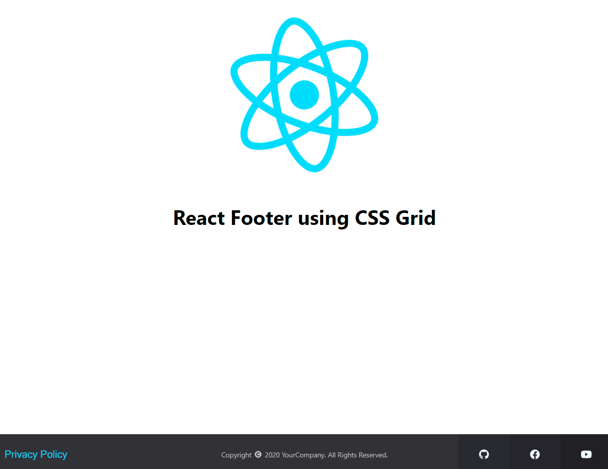

# Simple React Footer

A simpler footer element for your react app. Built with CSS Grid.

## Description

If you are building your prototype App using react, this simple footer is for you. Very easy and quick to implement. It also has responsive modal view for privacy policy and easily customizable.

## Installation

-   Clone the repo in your terminal by clicking the _green_ clone or download button at the top right and copying the url
-   In your terminal, type `git clone URL`
    -   replace URL with the url you copied
    -   hit enter
-   This will copy all the files from this repo down to your computer
-   In your terminal, cd into the directory you just created
-   Type `npm install` to install all dependencies
-   Last, but not least, type `npm start` to run the app locally.

-   To look at the code, just open up the project in your favorite code editor!

## Dependencies

-   react-responsive-modal
    -   Install: `npm install react-responsive-modal --save`
-   font awesome
    -   Install: `npm i --save @fortawesome/fontawesome-svg-core @fortawesome/free-solid-svg-icons @fortawesome/react-fontawesome`
    -   Install brands icon: `npm i --save @fortawesome/free-brands-svg-icons`
